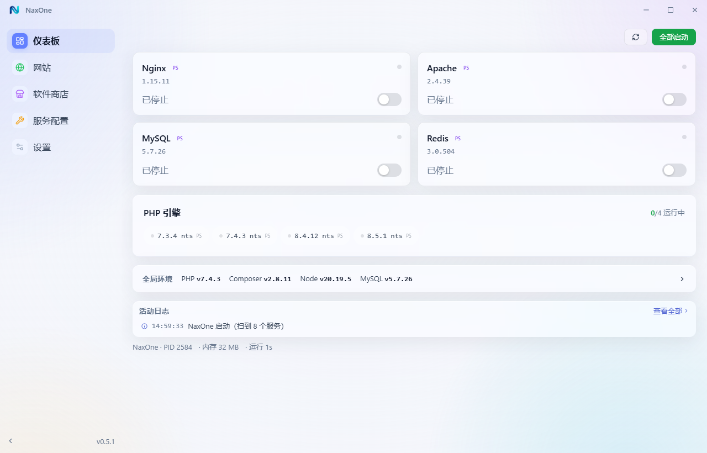
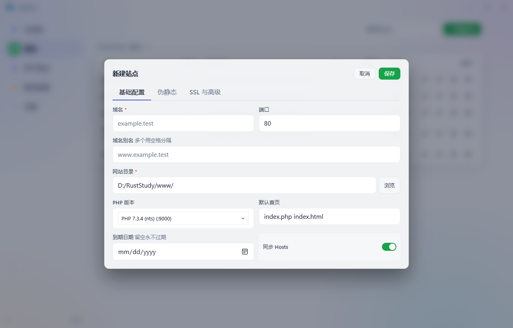
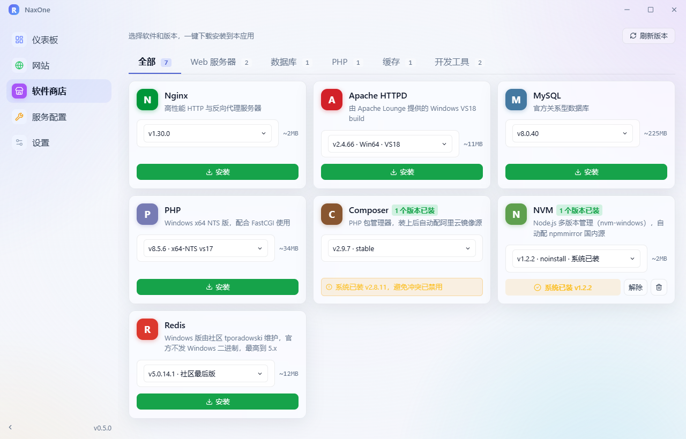
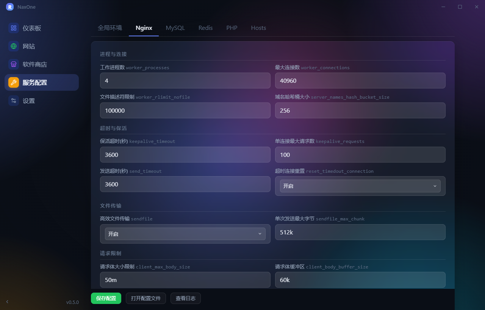
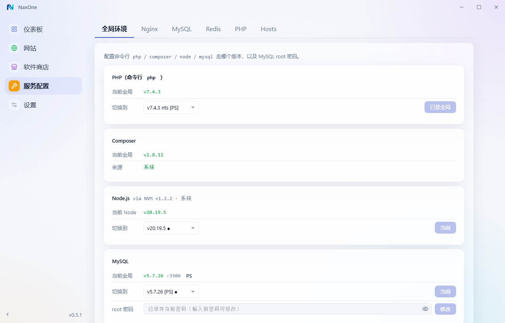
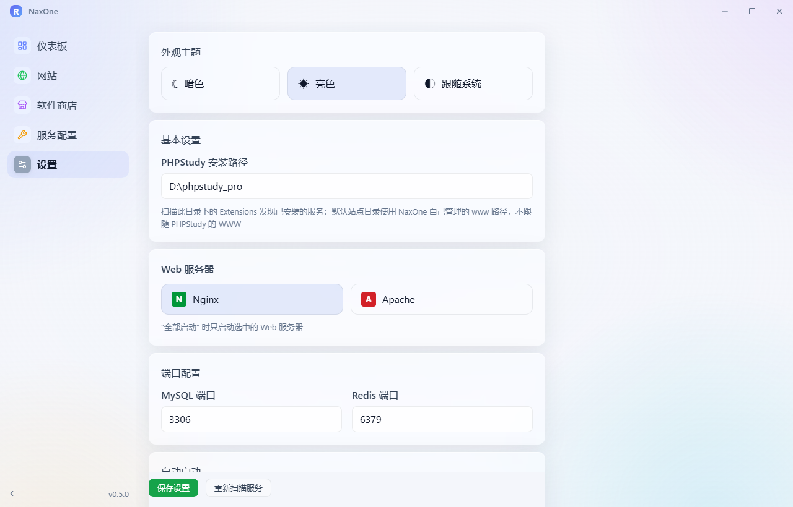
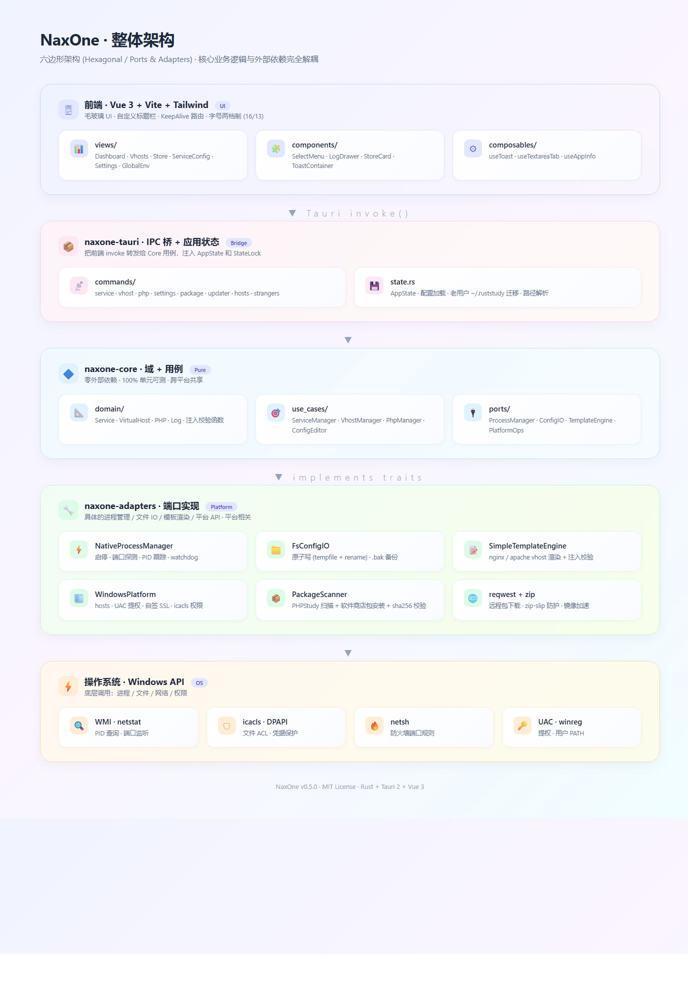
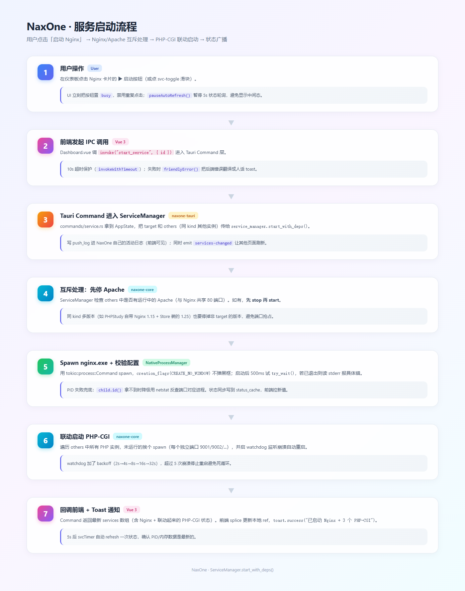
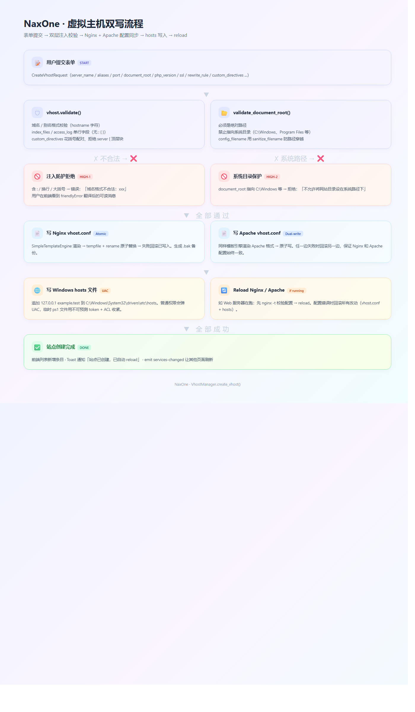

<div align="center">


# NaxOne

**一站式本地开发集成环境** · 用 Rust 重写、Tauri 打包、Vue 现代界面

[](LICENSE)
[](https://github.com/OverfireWater/naxone/releases)
[](https://github.com/OverfireWater/naxone/releases)
[](https://github.com/OverfireWater/naxone/stargazers)
[](https://gitee.com/kz_y/naxone/stargazers)
[](https://gitee.com/kz_y/naxone/members)

[下载安装包 (Gitee)](https://gitee.com/kz_y/naxone/releases/latest) · [下载安装包 (GitHub)](https://github.com/OverfireWater/naxone/releases/latest) · [问题反馈](https://gitee.com/kz_y/naxone/issues)

**中文** · [English](README_EN.md)

</div>

---

NaxOne 是面向 PHP 开发者的 Windows 本地开发集成环境管理器。一个原生桌面 App 把 Nginx / Apache / MySQL / Redis / 多版本 PHP 全部装进同一个面板，启停、配置、虚拟主机、SSL 一站搞定。

技术栈：**Rust + Tauri 2 + Vue 3 + TypeScript**。冷启动 < 1s，内存常驻 < 100MB，安装包约 6MB。

> **跟 PHPStudy 是什么关系？** NaxOne **不依赖 PHPStudy**，可以独立安装、独立运行。但如果你机器上**已经有 PHPStudy**，NaxOne 会自动识别它的安装目录、PHP/Nginx/MySQL 包，把它们也纳入管理——无需重装、不破坏现有站点。两者互不影响、平滑共存。

## 功能亮点

- **服务管理**：一键启停 Nginx / Apache / MySQL / Redis / PHP-CGI；Nginx 与 Apache 自动互斥；启动 Web 服务器联动拉起 PHP-CGI；端口探测 + 进程名校验，状态绝不假阳性
- **虚拟主机**：创建 / 编辑 / 删除；Nginx + Apache 配置**双写**（切引擎零成本）；自动写入 hosts；改完即时 reload；伪静态预设（Laravel / ThinkPHP / WordPress / Webman）；一键 mkcert HTTPS（自动建本地 CA + 签 leaf 证书，浏览器直接绿锁）
- **站点模板一键装**：新建 vhost 时选 **空白 / WordPress / Laravel / ThinkPHP / Webman**，自动下载或 `composer create-project`；框架装完自动指到 `public/` 入口子目录 + 配套伪静态 + （Webman 的）proxy_pass
- **PHP 多版本**：本地装多个 PHP，每个站点选独立版本；全局 CLI `php` 命令一键切版本（用户 PATH 挂 shim，新开终端立即生效）；Composer / Node / MySQL 同样支持切版本
- **服务配置**：Nginx 19 项 / MySQL 25 项 / Redis 20 项 / PHP 34 项可视化配置；PHP 扩展开关；改动前自动 `.bak`；保存前数值字段范围校验，避免 nginx reload 报 emerg
- **活动日志**：所有写操作（启停 / vhost CRUD / 模板装包 / 扩展安装 / 切版本 / kill 进程）都归档到活动日志面板，支持**关键字搜索 / 分类过滤 / 失败行高亮**；流式日志（composer / WordPress 下载）的完整 stdout/stderr 作为 details 存在条目里，关掉 modal 也能回查
- **软件商店**：内置 PHP 官方源 + GitHub 镜像源，按需下载历史版本，多镜像加速，SHA-256 校验
- **PHP 扩展**：基于 [PIE](https://github.com/php/pie) 一键装/卸；自动选 PHP 8.1+ 当 runtime；流式装包日志
- **陌生进程检测**：仪表板自动识别外部占用 80/3306/6379 等端口的进程（含 PHPStudy 自带服务），点一下即可结束；启动服务遇端口冲突自动弹诊断对话框
- **现代体验**：紧凑界面、亮色/暗色主题切换、无原生标题栏、系统托盘最小化、Tauri 自动更新

## 界面预览

### 仪表板
毛玻璃 + 多色光晕，Nginx/Apache/MySQL/Redis 一行启停，PHP 多版本统一管理，底部活动日志快览。



### 新建站点
三 tab：基础配置 / 伪静态预设 / SSL 与高级。可一键选择 WordPress / Laravel / ThinkPHP / Webman 模板自动装包，自动同步 hosts、自动签 HTTPS 证书。



### 软件商店
内置 PHP/Nginx/MySQL 等多版本下载，多镜像加速，sha256 校验。



### 服务配置 · Nginx
19 项常用 Nginx 选项可视化编辑，改动前自动 .bak 备份。



### 全局环境
CLI `php` / `composer` / `node` / `mysql` 一键切版本。



### 设置
PHPStudy 路径 / WWW 根目录 / 端口 / 自启动 / 主题。



> 更多截图见 [docs/screenshots/](docs/screenshots/)（13 张，覆盖所有页面）

## 安装

直接下最新版安装包：

| | 链接 |
|---|---|
| 国内（推荐） | [Gitee Releases](https://gitee.com/kz_y/naxone/releases/latest) |
| 海外 | [GitHub Releases](https://github.com/OverfireWater/naxone/releases/latest) |

文件名 `NaxOne_X.Y.Z_x64-setup.exe`，约 6 MB。NSIS 打包，**默认装到 `D:\NaxOne`**（如果你 D 盘存在，否则 `C:\NaxOne`）。

要求 Windows 10 1809+ / Windows 11，x64 架构。

### 首次运行：Windows SmartScreen 警告

首次运行时 Windows 可能弹：

> Windows 已保护你的电脑
> Microsoft Defender SmartScreen 阻止了启动一个未识别的应用…

绕过方法（任选其一）：

1. 弹窗里点 **更多信息** → **仍要运行**
2. 右键 .exe 文件 → **属性** → 勾选 **解除阻止** → 确定
3. PowerShell：`Unblock-File -Path "D:\NaxOne\NaxOne.exe"`

## 从源码构建

### 前置

- [Rust](https://rustup.rs/) >= 1.75
- [Node.js](https://nodejs.org/) >= 20

### 开发模式

```bash
# 安装前端依赖
cd crates/naxone-tauri/frontend
npm install

# 启动（自动跑 Vite + 编译 Rust + 起 Tauri 窗口）
cd ..
cargo tauri dev
```

### 打包

```bash
cargo tauri build
# 安装包位于 target/release/bundle/nsis/
```

### 运行测试

```bash
cargo test --workspace
```

## 架构

采用**六边形架构**（Hexagonal / Ports & Adapters），核心业务逻辑跟外部依赖完全解耦。



- **`naxone-core`**：纯领域逻辑，零外部依赖，可独立单元测试
- **`naxone-adapters`**：实现 core 定义的 Port traits，可替换（未来做 Linux TUI 只换这层）
- **`naxone-tauri`**：只做 IPC 转发 + 应用初始化

### 服务启动流程（含互斥 + 联动）



### 虚拟主机双写流程（Nginx + Apache 同步）



## 项目结构

```
naxone/
├── Cargo.toml                          # Workspace 根（统一版本、共享依赖）
├── LICENSE                             # MIT
├── logo.png / logo_transparent.png     # 品牌资源
├── crates/
│   ├── naxone-core/                    # 纯领域逻辑，零外部依赖
│   │   └── src/
│   │       ├── domain/                 # 领域模型：Service / VirtualHost / PHP / Log
│   │       ├── ports/                  # 端口 trait：ProcessManager / ConfigIO / TemplateEngine / PlatformOps
│   │       ├── use_cases/              # 用例：ServiceManager / VhostManager / PhpManager / ConfigEditor
│   │       ├── config.rs               # AppConfig（TOML 配置反序列化）
│   │       └── error.rs                # 统一错误类型
│   │
│   ├── naxone-adapters/                # 端口的具体实现
│   │   └── src/
│   │       ├── config/                 # FsConfigIO（文件 IO）
│   │       ├── package/                # 包扫描 + 软件商店（PHP 官方源 / GitHub 镜像源）
│   │       ├── platform/               # WindowsPlatform / LinuxPlatform（hosts、SSL 自签、全局 PHP shim）
│   │       ├── process/                # NativeProcessManager（进程启停 + 端口探测）
│   │       ├── template/               # SimpleTemplateEngine（生成 nginx/apache vhost 配置）
│   │       └── vhost/                  # VhostScanner（解析现有虚拟主机）
│   │
│   └── naxone-tauri/                   # 桌面 App 壳
│       ├── src/
│       │   ├── main.rs                 # Tauri 入口（系统托盘、插件注册）
│       │   ├── state.rs                # AppState（依赖注入、配置加载、老用户迁移）
│       │   └── commands/               # Tauri IPC 命令：service / vhost / php / settings / package / updater ...
│       ├── frontend/                   # Vue 3 + Vite + Tailwind 前端
│       │   └── src/
│       │       ├── App.vue             # 根布局（自定义标题栏、侧栏、路由）
│       │       ├── views/              # 页面：Dashboard / Vhosts / ServiceConfig / Settings
│       │       ├── components/         # 复用组件：StoreCard / LogDrawer / SelectMenu ...
│       │       └── assets/             # global.css（Tailwind + 主题变量）
│       ├── tauri.conf.json             # Tauri 配置
│       ├── nsis/installer-hooks.nsh    # Windows 安装器自定义（默认装到 D:\NaxOne）
│       ├── icons/                      # 应用图标（自动从 logo.png 生成）
│       └── capabilities/               # Tauri 权限配置
```

## 兼容性

- **PHPStudy Pro**：自动扫描其 `Extensions` 目录里的 PHP/Nginx/Apache/MySQL/Redis 包；生成的 vhost 配置格式与 PHPStudy 完全一致，可双向迁移
- **PHP 官方包**：直接识别 windows.php.net 下载的 zip 解压目录
- **配置文件**：所有写操作前自动 `.bak` 备份
- **跨电脑**：所有数据落在 `%USERPROFILE%\.naxone\`（vhost 列表、CA 证书、活动日志），单文件夹拷贝可迁移

## 许可证

[MIT](LICENSE) © 2026 NaxOne Contributors

PHP/Nginx/Apache/MySQL/Redis 等被管理的二进制各自遵循其原有许可证（PHP License / BSD / Apache 2.0 / GPL / BSD），NaxOne 仅作为本地启停和配置工具，不重分发上述二进制。
